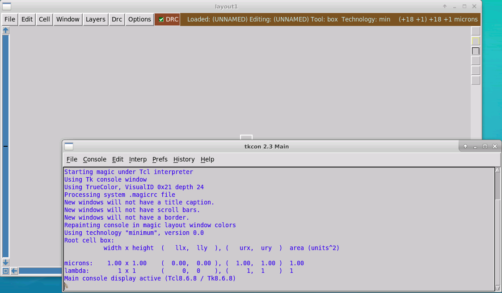
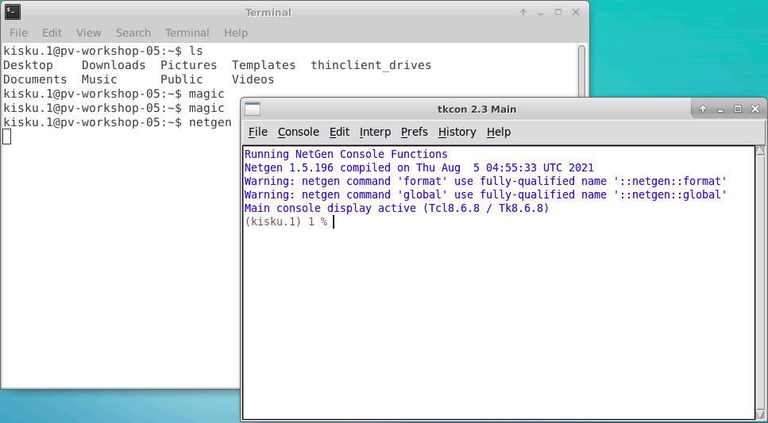
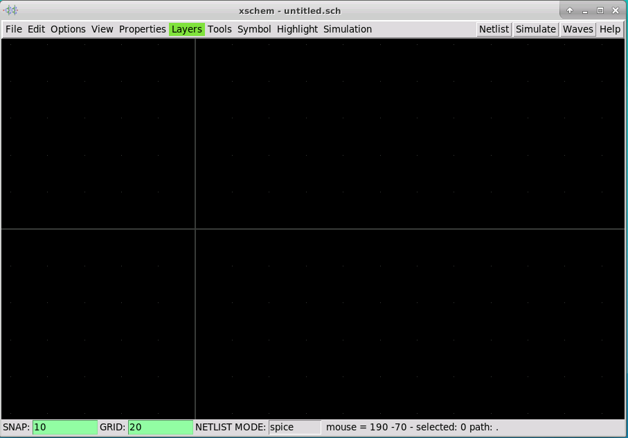
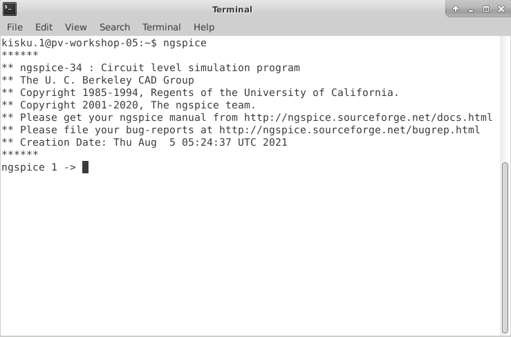

# Physical Verification using skwater 130 nm Technology

The need for physical verification is imperetaive for developing a design that is manufacturable, having a high probaility of obtaining a GDSII layout that can be successfully taped out. Thanks to the development of openSource tools that has been a driving impetus for democratizing chip design and almost (if not fully) has automated the chip deisgn flow (RTL-to-GDSII).

The RTL is a register transfer level netlist of the chip that is in the making. One of the most important process is going from the RTL (from HDL languages) to a complete layout is that is the GDSII format of layout format that can be sent to the foundry for manufacturing the chip.  

## Content
  - [Day 1](#day-1)
    - [OpenROAD flow](###openroad-flow1)
  - [Day 2](#day-2)
    - [OpenROAD flow](#openroad-flow2)
### Day 1 
### OpenROAD flow1

 
 
 
 

### Day 2 
### OpenROAD flow2
