# Physical Verification using skwater 130 nm Technology

The need for physical verification is imperetaive for developing a design that is manufacturable, having a high probaility of obtaining a GDSII layout that can be successfully taped out. Thanks to the development of openSource tools that has been a driving impetus for democratizing chip design and almost (if not fully) has automated the chip deisgn flow (RTL-to-GDSII).

The RTL is a register transfer level netlist of the chip that is in the making. One of the most important process is going from the RTL (from HDL languages) to a complete layout is that is the GDSII format of layout format that can be sent to the foundry for manufacturing the chip.  

## Content
  - [Day 1](#day-1)
    - [Check Tool Installations](#check-tool-installations)
    - [Creating Sky130 Device Layout in Magic](#creating-sky130-device-layout-in-magic)
    - [Creating Simple Schematic in Xschem](#creating-simple-schematic-in-xschem)
    - [Creating Symbol and Exporting Schematic in Xschem](#creating-symbol-and-exporting-schematic-in-xschem)
    - [Importing Schematic to Layout and Inverter Layout Steps](#importing-schematic-to-layout-and-inverter-layout-steps)
    - [Final DRC/LVS Checks and Post Layout Simulations](#final-drc/lvs-check-and-post-layout-simulations)
    
  - [Day 2](#day-2)
    - [GDS Read](#gds-read)
    - [Port](#ports)
    - [Abstract Views](#abstract-views)
    - [Basic Extraction](#basic-extraction)
    - [Setup for DRC](#setup-for-drc)
    - [Setup for LVS](#setup-for-lvs)
    - [Setup for XOR](#setup-for-xor)

  - [Day 3](#day-3)
    - [Lab for Width Rule and Spacing Rule](#)
    - [Lab for Width Spapcing Rule and Notch Rule](#)
    - [Lab for Via Size, Multiple Vias, Via Overlap and Autogenerate Vias](#)
    - [Lab for Minimum Area Rule and Minimum Hole Rule](#)
    - [Lab for Wells and Deep N-Well](#)
    - [Lab for Derived Layers](#)
    - [Lab for Parameterized and PDK Devices](#)
    - [Lab for Angle Error and Overlap Rule](#)
    - [Lab for Unimplemented Rules](#)
    - [Latch-up and Antenna Rules](#)
    - [Lab For Density Rules](#)
    
  - [Day 4](#day-4)
    - [](#)
    - [](#)
    - [](#)

  - [Day 5](#day-5)
    - [Simple LVS Experiment](#)
    - [LVS with Subcircuit](#)
    - [LVS with Blackboxes Subcircuit](#)
    - [LVS with SPICE Low Level Component](#)
    - [LVS with SPICE Low Level Components](#)
    - [LVS for Small Analog Block PowerOnReset 1](#)
    - [LVS for Small Analog Block PowerOnReset 2](#)
    - [LVS for Macros](#)
    - [LVS Digital PLL 1](#)
    - [LVS Digital PLL 2](#)
    - [LVS with Pproperty Errors](#)

    
### Day 1 
#### Check Tool Installations
The tools have been installed in the VSD sandbox with the PDKs installed and built. While these can be installed by cloning the github repository and then building the source from scratch. The tools and the PDKs that are used in the workshop are free and open source. They can be easily installed in Linux systems such as Ubuntu, CentOS etc.

The tools can be compiled from the source, from github. This makes sure that the tools that has been built is uptodate and has the most recent version with bugs that have been taken care of to date.

To invoke commands, use the termial with the associated binaries for the tools that have been added to the path during the installations and which can be invoked from the command line. Tools such as **magic, netgen, xschem, ngspice** are all as simple as typing the specific names on the terminal window and either getting the GUI interface or a command line interface for the tools (tcl command interface generally).

```
$ magic
```
The Figure below is the **magic** interface and the tcl console, **netgen**, **xschem** for building the schematics and ngspicie for simuation using **ngspice**. 

 
 
 
 
 
 Commands for invoking the different tools that are specific to the tasks for the verification process **magic** for layout, **xschem** for schematic, **netgen** where it is a tool for comparing netlists, a process known as LVS, which stands for "Layout vs. Schematic".
 ```
 magic -noconsole         #without console
 magic -dnull -noconsole  #to be invoked while **batch mode** and when invoked from a script
 magic -dnull -noconsole foo.tcl
 
 netgen -noconsole        #without console
 netgen -batch source foo.tcl
 
 xschem --tcl foo.tcl -q
 
 netgen -b  # batch mode
 ```
 
There is a need to setup the directory hierarchy for running the tools for a particular project that follows the same structure throughout projects.


```
mkdir xschem
mkdir mag
mkdir netgen

ln -s /usr/share/pdk/sky130A/libs.tech/xschem/xschemrc
ln -s /usr/share/pdk/sky130A/libs.tech/ngspice/spinit .spiceinit
cd ../mag
ls -s /usr/share/pdk/sky130A/libs.tech/magic/sky130A.magicrc .magicrc
cd ../netgen
ln -s /usr/share/pdk/sky130A/libs.tech/netgen/sky130A_setup.tcl setup.tcl
```
#### Creating Sky130 Device Layout in Magic

The Magic tools shows the technology associated linked with the **magic** instance can be run with a command **magic -d XR** for better and saturated display of the layers and text values.
 
 Can **quit** with the **quit** command on the console or the **File->Quit** optin from the GUI.
 
 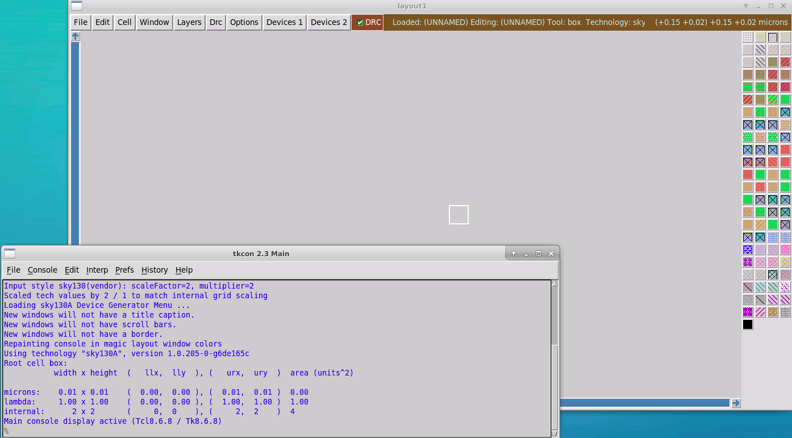 
 
The below figure shows a lot of examples that can be explored. The link shows as blocks on left of the windows by clicking on it and type **e** for enter, typing **ctrl+e** to get back.
 
 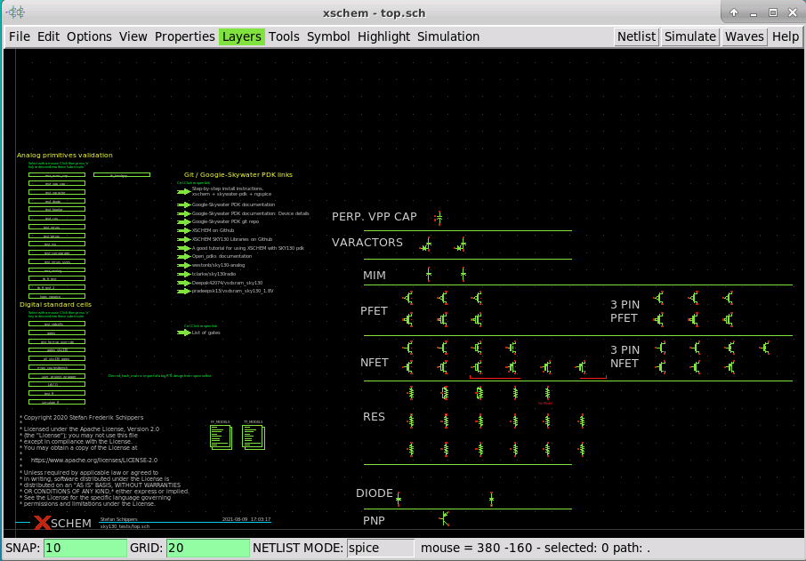

There are various tips to work with the magic tools for drawing, selecting and placing the layers:

- **Left** and **Right click** to create a box for placing layer values
- Middle mouse button to add the layer -> **painting**
- **e** to erase after creating the boxes using the right and left clicks of the mouse
- Can be panned and zommed using the scroll 
- Layout can be created using the schematic or also can be drawn freehand.
- **Devices1** and **Devices2** can be selected from which the device parameters for NMOS and PMOS can be changes, that have been selected.
- click on **v** to view the layout if it pans out of the viewing area.
- From the paramerters menu things like **guard rings, transistors from device type can be changed, guard value** can be changed. If the window is closed can be opening using **ctrl+p**
- If you are working in the layout type **;** andn type a command without going to the command window.
- **what** command to know about the selection in the layout window
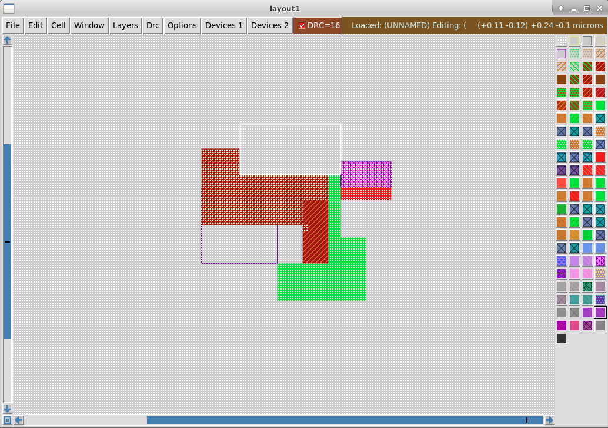
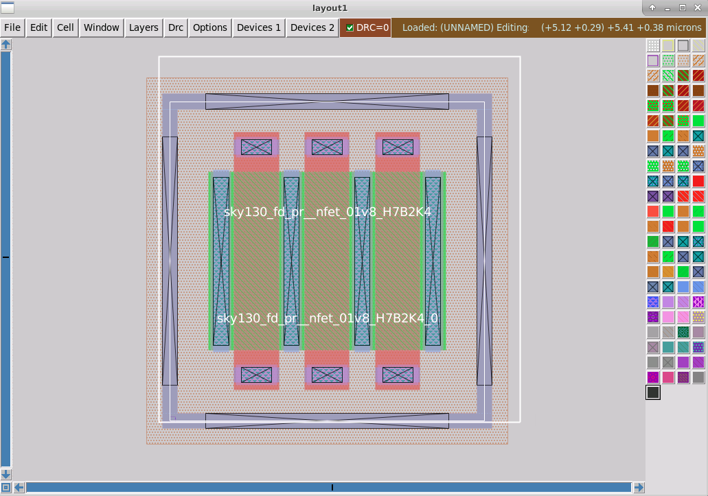

#### Creating Simple Schematic in Xschem

Creating the chematic
- File **New Schematic**
- The windows contains three different libraries 
  - Working Directory
  - Skywater PDK (select for the MOSFETs)
  - Xschem generic library for voltages and other for simulations
- Select from the library **nfet_01v8.sym** need to select a four terminal device as the bulk is necessary and as in 3 terminal device it is mentioned as a parameter.
- Libray can be opened again using the **insert** key from the keyboard.
- Same thing to select the pfet. (select the fet without the bulk terminal)
- Since pins are not speciic to the technology or library so select it from the generic library.
- **M** ket can be used to move it. (place the **ipin**, **opin** and **iopin**)
- **W** to wire the components.
- **Delete** to delete the components.
- Changing the pin names by cliking and typing **q** to replace the **xxx** values to a resonably unstandable names.
- select nfet and type **q** to change the values to **L=0.18, W=4.5, nf=3**, for pfet **L=0.18, W=3, nf=3**

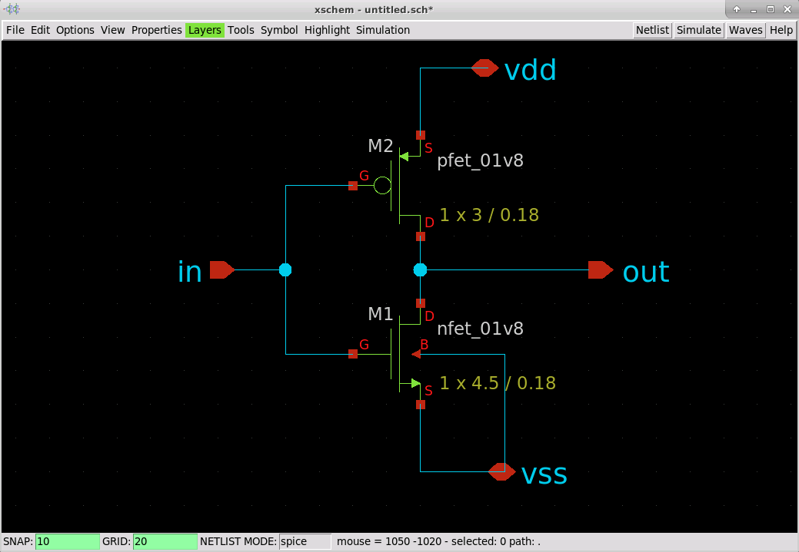

#### Creating Symbol and Exporting Schematic in Xschem

- The testbench is created to check the functional validation of the schematic that has been created by keeping it isolated with the schematic file that has been created.
- The Volatage sources can be drawn from the generic library
- click and select the voltage and type **q** and set to **1.8**
- value of the input voltage to the inverter needs to be put to **"PWL(0 0 20n 0 900n 1.8)"**
- Add codes for running the simulation
  - add from the library and select **code_shown.sym**
  - Get the device models from the library **value = ".lib /usr/shar/pdk/sky130A/libs.tech/ngspice/sky130.lib.spice tt"**, where tt is the process corner.
  - Add a second code block for simulating with the given change as **value = ".control \
  tran 1n 1u \
  plot V(in) V(out) \
  .endc"**
  - From the xschem window click on the **netlist** opption on the top right and then select **simulate** to run the simulation, it takes a while to start as it loads all the library elements.
  - It runs and then creates a plot.
  - After the simulation the schematic (of which the layout needs to be created has to be selected ans then from **schematic** select **LVS netlist: Top level is a .subckt**. This ensures that the subcircucit is propeprly defined for creating the layout with pinsn in the layout.
  - Then finally click on the netlist again to generate a netlist.
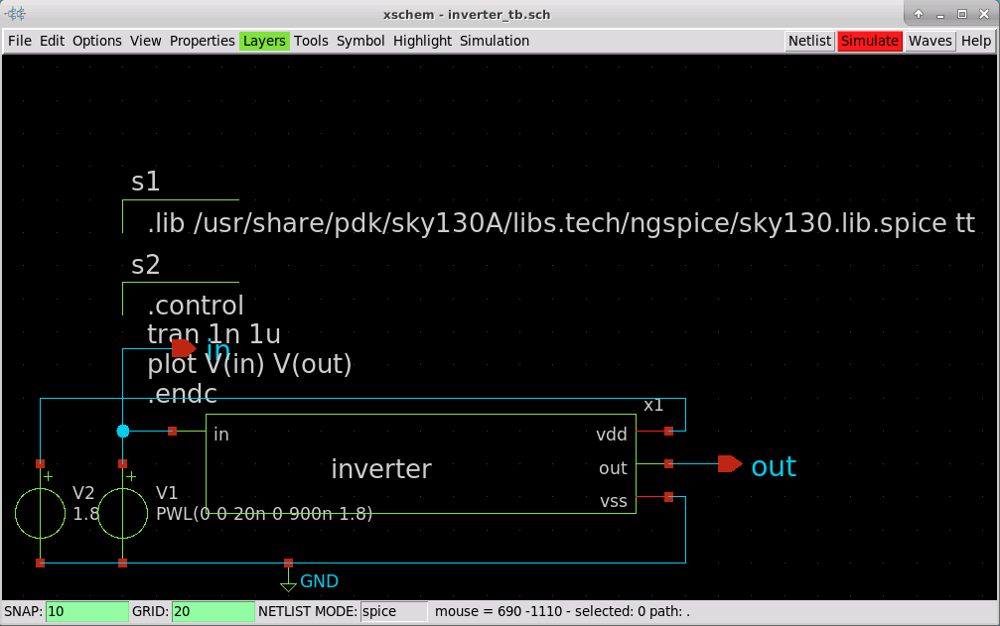
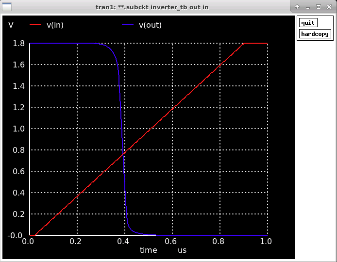
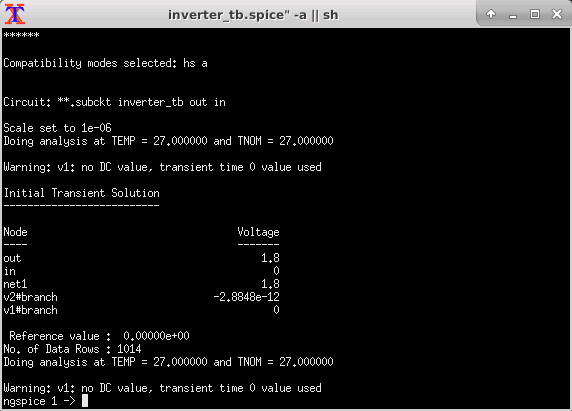

#### Importing Schematic to Layout and Inverter Layout Steps
#### Final DRC/LVS Checks and Post Layout Simulations

### Day 2 
#### GDS Read
The GDS file comes form the skywater foundry that can be checked for the cell layouts.

```
$ mkdir workdir
$ cd workdir
$ mkdir mag
$ cd mag
$ cp /usr/share/pdk/sky130A/libs.tech/magic/sky130A.magicrc ./.magicrc #copies the magicrc from the sky130A library for magic
```

Commands in the Magic tcl console for reading the styles that have been set by defualt and then reading the **gds** from the SKY130 library as we are working with this paprticular foundry.

```
Main console display active (Tcl8.6.8 / Tk8.6.8)
% cif listall istyle
sky130(vendor) sky130() rdlimport
% cif list istyle
sky130(vendor)
% cif list istyle xxx
"xxx" is not one of the CIF input styles Magic knows.
The current style is "sky130(vendor)".
The CIF input styles are: sky130(vendor), sky130(), rdlimport.
% cif istyle xxx
"xxx" is not one of the CIF input styles Magic knows.
The current style is "sky130(vendor)".
The CIF input styles are: sky130(vendor), sky130(), rdlimport.
% gds read /usr/share/pdk/sky130A/libs.ref/sky130_fd_sc_hd/gds/sky130_fd_sc_hd.gds
```
Now to select from the **lib.ref** from the SKY130 library use the cell manager from the options menu on the top menu bar and then select the cell manager.

 - Select the and (2 input and 1 output **and cell**) 
 - By default the istyle that has been set is the **sky130(vendor)**
 - can be changed using the command **cif istyle sky130(vendor)**
 - can rerun the **gds read**
 - it clears the old gds files and replace it by the new, where the vendor file. The **vendor** styles has the port information (**yellow -> blue**).
 - **cif istyle sky130()**
 - **gds noduplicate true** helps to read only the cell defintions that have not been already read in.

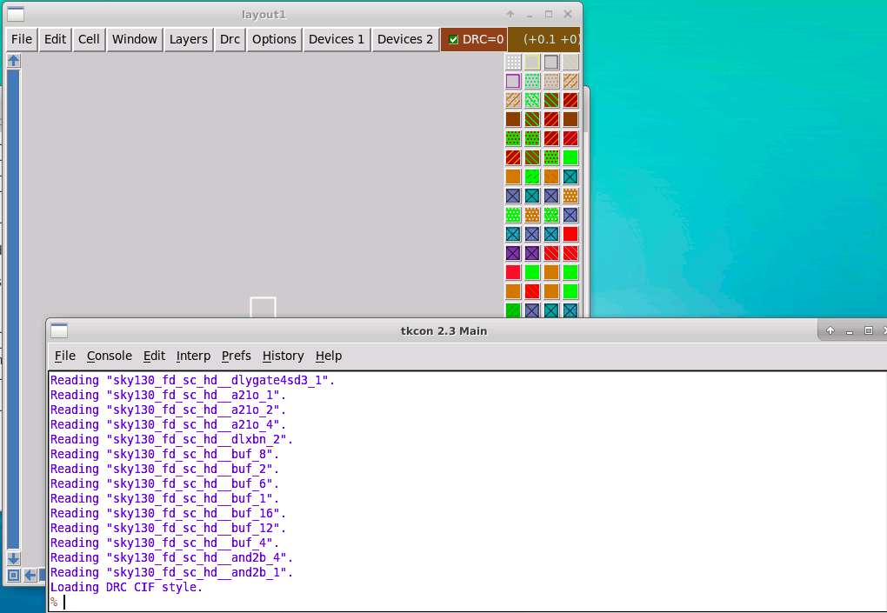
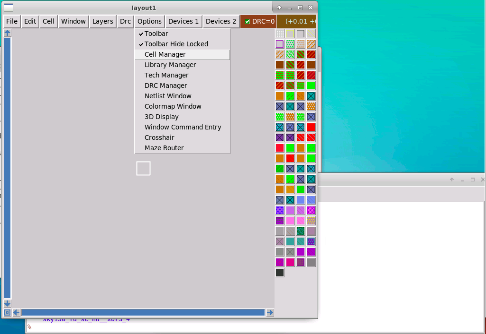
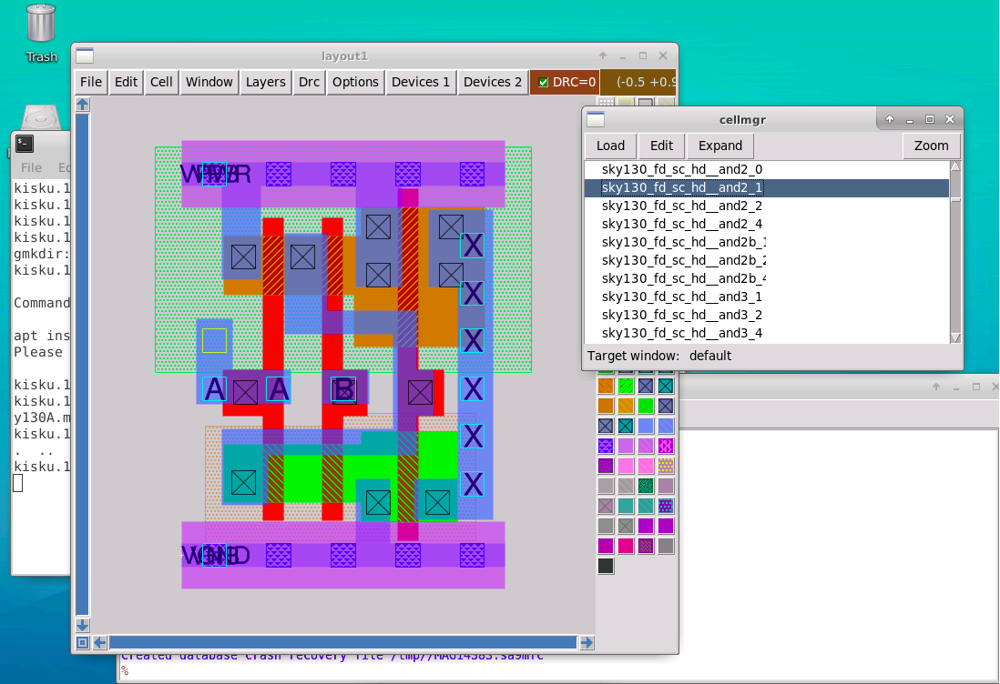

#### Port
The port can be selected using the **right** and the **left** selection keys by creating a bounding box over the ports and querying using the tcl console window. The issue with this is with overlapping ports and that can be recified using the following procedure.

```
% port index
3
% port index
Exactly one label may be present under the cursor box.
Use "port <name> ..." to specify a uniqe port.
% **port first**
```
- **port first** to query for the first selected port
- **port <number> class** to get the infomation on the pin, but the issue here is that it is the metadata information that is not present in the gds. While the **lef files has the metadata** information. in spice the metadata that is the pin order is important.
  
```
$ ls /usr/share/pdk/sky130A/libs.ref/sky130_fd_sc_hd
$ cd /usr/share/pdk/sky130A/libs.ref/sky130_fd_sc_hd/spice  #spice library for the standard cells
$ vi sky130_fd_sc_hd_spice #edit the file and search for the file for and2_1
```
The spice file has the port ordering but this is the metadata that is mentioned in the spice related file and not in the gds file. **Magic keeps the port order, along with the metadata**.

The metadata can be anotated:
```
% lef read /usr/share/pdk/sky130A/libs.ref/sky130_fd_sc_hd/lef/sky130_fd_sc_hd.lef
Reading LEF data from file /usr/share/pdk/sky130A/libs.ref/sky130_fd_sc_hd/lef/sky130_fd_sc_hd.lef.
This action cannot be undone.
LEF read: Processed 68161 lines.
```
It contains the macros for all the cells and the metadata.
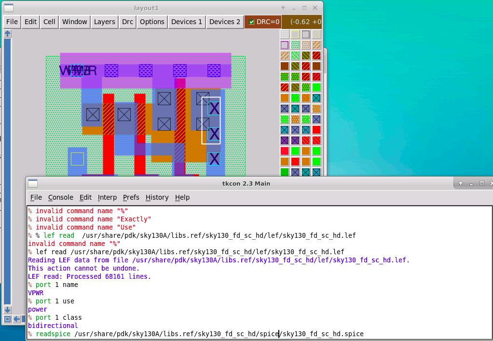
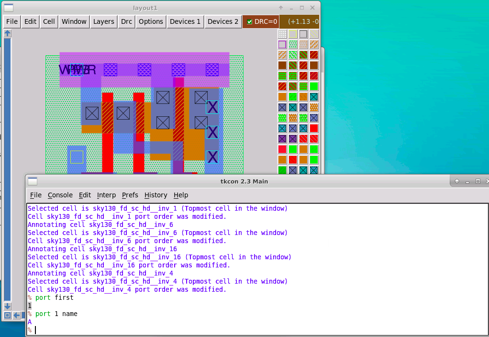
  
#### Abstract Views

Reading the lef file shows an abstract (not a detailed) view of the layout. Read the spice file adds the port information from the sppicce definition in the library. This shows that all the transistors has been lost.

- The abstract views are not a exact reprsentation
- **load test**
- Put the cursor box on the window and then type.
- **getcell sky130_fd_sc_hd__and2_1**
- This gets the abstract layout (**v** to view the cell,**s** to select and **x** to expand), still the abstract view
- **gds write test** gives an error message as this is an abstract view
- read again the gds that has been written (magic should not work with metadata only)

```
% load test
% getcell sky130_fd_sc_hd__and2_1
sky130_fd_sc_hd__and2_1_0
Loading DRC CIF style.
Selected cell is test/sky130_fd_sc_hd__and2_1 (sky130_fd_sc_hd__and2_1_0)
select: sky130_fd_sc_hd__and2_1_0
% gds write test
Warning:  Writing abstract view of "sky130_fd_sc_hd__and2_1" to GDS.  This is probably not what you want to do.
   Generating output for cell sky130_fd_sc_hd__and2_1
   Generating output for cell test
```
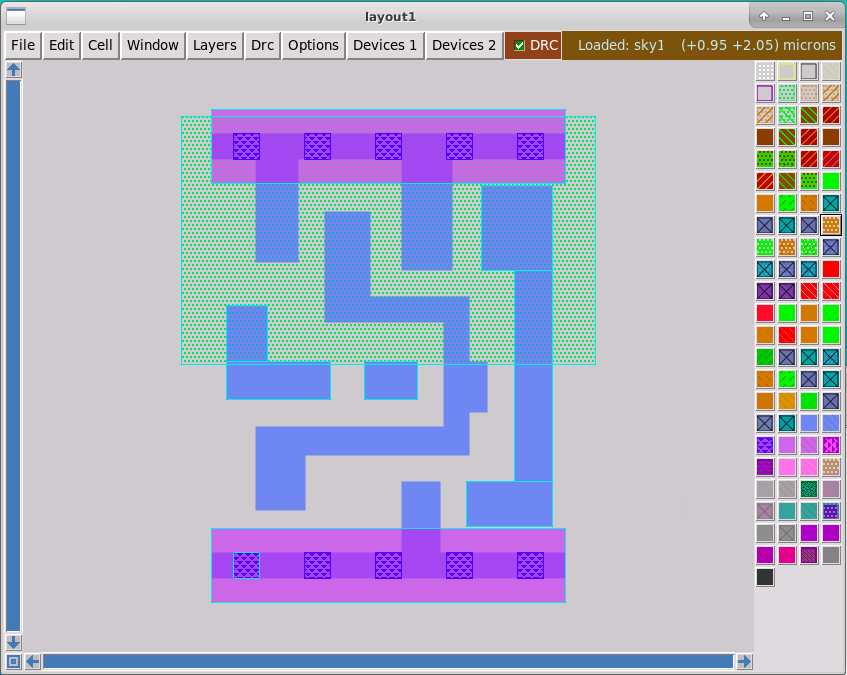
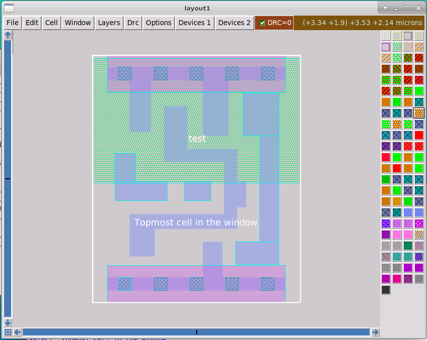
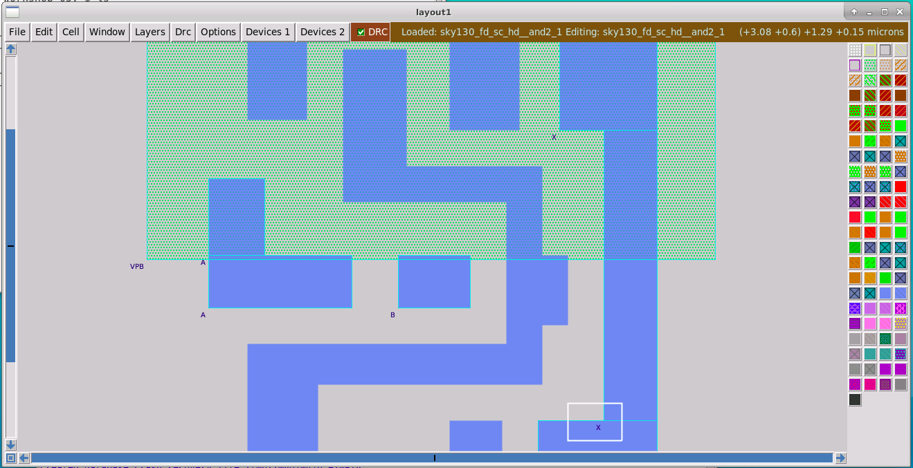

 - While the abstract views are cannot result in a valid gds file, there are workaround to get a valid gds layer.
 - The local directory has a **test.mag** file.
 - The **load test** command get a clean image of the gds of the **and** gate.
 - The **save command** works on the current cell that is being worked on and does not care about the sub cells. Thus is does not save the sky130_fd_sc_hd_and2_1.mag information which saving the test file as a mag file.
 
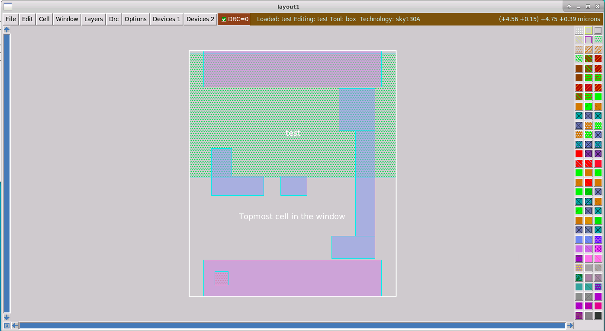
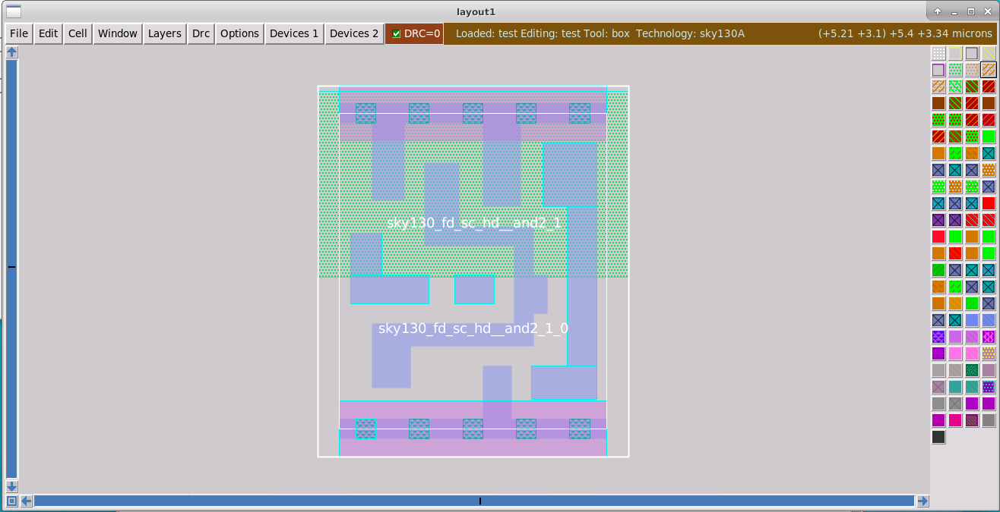
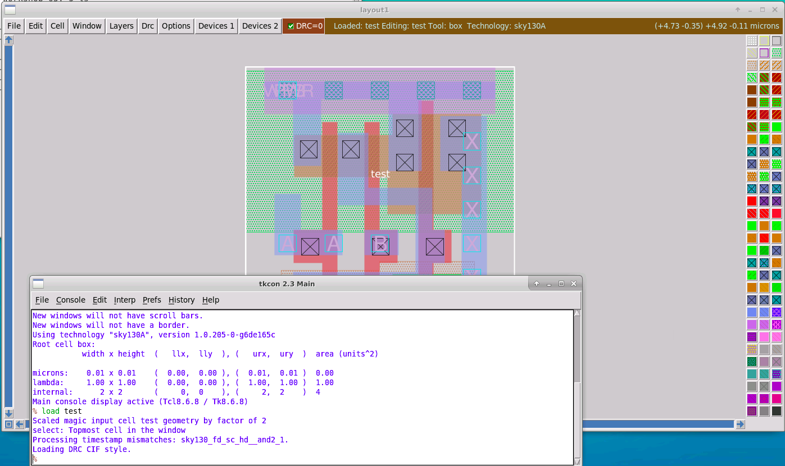

 - Working with the**abstract view** can be to obtain views that can be changed without affecting the actual verndor specified files.
 - To view the cell property type **property**, selecting the cell hierachy using the **shift+(greaterthan)** (going to the top level within the cell) and **shift+(lessthan)** desceding into the cell hierarchy.
 - The effect of making changes and saving into the abstracct views can be seen using the inpainting tools and making changes after making the cell editable. **gds writeable sky130_fd_sc_hd__and2_1 true** can be used to make it editable and then made changes into.
 - **gds write test** and **gds_read_test** after restarting magic verifies that changes into the standard cells have not been retained.
  
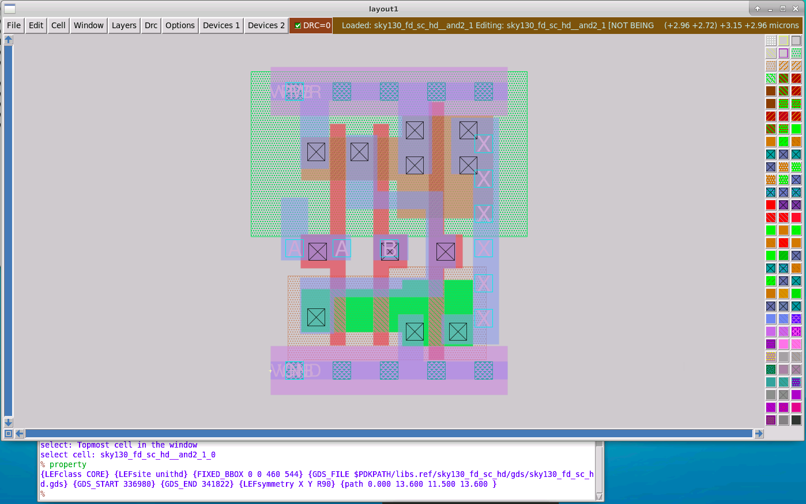
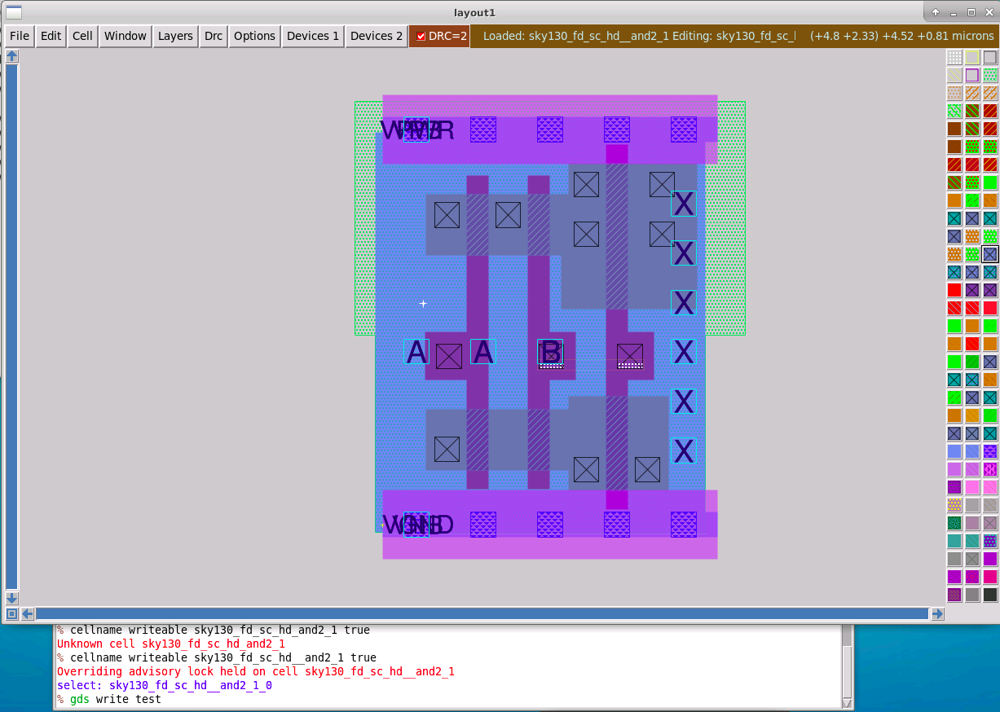
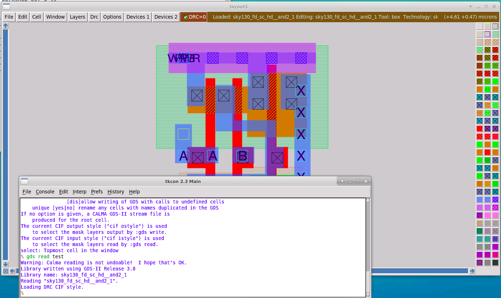

Reading the gds files from cell using the follwoing command:
```
% gds readonly true
% gds rescale false
% gds read /usr/share/pdk/130A/sky130_fd_sc_hd/gds/sky130_fd_sc_hd.gds
[...]
% load sky130_fd_sc_hd__and2_1
% property
{FIXED_BBOX 0 0 460 544} {GDS_FILE $PDKPATH/libs.ref/sky130_fd_sc_hd/gds/sky130_fd_sc_hd.gds} {GDS_END 341822} {GDS_START 336980} {path 0.000 13.600 11.500 13.600 }
```
Realoading the gds files from the standard library now makes sure that the file metadata are are kept as the property in the current gds read file.
- Create a Cell like **and2_1** from the **mag** folder.
- Read vendor gds **readonly mode**, annotate it with lef and spice.
- Write it locally and comapare if the two files created locally and the one in the standard library are the same or not.
- The entire process deals with working with abstract views for the standard libraries and creating new standalone gds files from the pdks, locally.
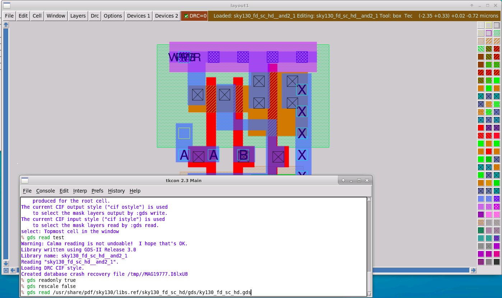
  
#### Basic Extraction

The extraction methods gets the spice netlist file from the layout file or the gds files that has been created or taken from the standard library and connect as a subcircuit.
  
```
load sky130_fd_sc_hd__and2_1
extract all

ext2spice lvs
ext2spice

ext2spice cthresh 0
ext2spice

ext2spice cthresh 0.01
ext2spice
```
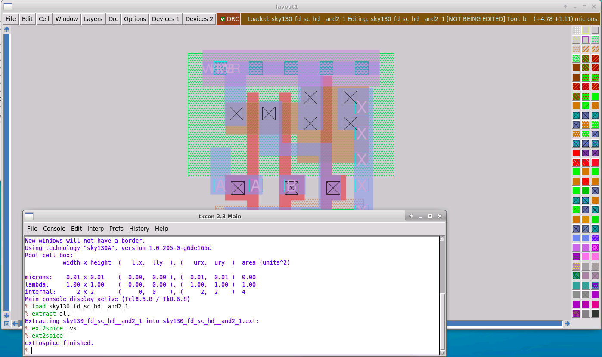
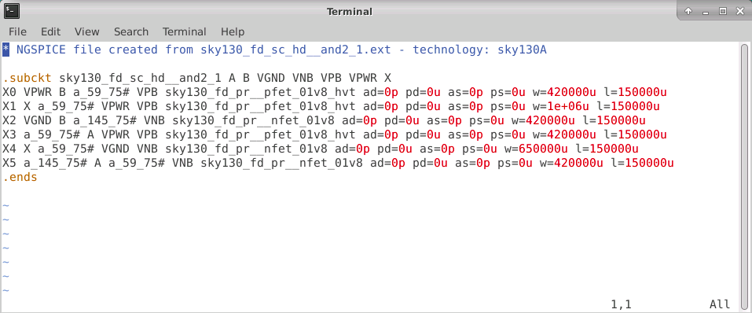

For the RC extraction you need to run the following command on the tcl console:
- to generate a node file
- to generate a sim file
```
ext2sim labels on
ext2sim
```

```
[...]
Port: name = X exists, forcing drivepoint
Location is (397, 425); drivepoint (397, 153)
Port: name = X exists, forcing drivepoint
Location is (397, 425); drivepoint (397, 85)
Port: name = X exists, forcing drivepoint
Location is (397, 425); drivepoint (397, 221)
Port: name = X exists, forcing drivepoint
Location is (397, 425); drivepoint (397, 289)
Port: name = X exists, forcing drivepoint
Location is (397, 425); drivepoint (397, 357)
Port: name = X exists, forcing drivepoint
Location is (397, 425); drivepoint (397, 425)
Port: name = B exists, forcing drivepoint
Location is (213, 221); drivepoint (213, 221)
Port: name = A exists, forcing drivepoint
Location is (29, 221); drivepoint (121, 221)
Port: name = A exists, forcing drivepoint
Location is (29, 221); drivepoint (29, 221)
Port: name = VPB exists, forcing drivepoint
Location is (29, 527); drivepoint (29, 527)
Port: name = VNB exists, forcing drivepoint
Location is (29, -16); drivepoint (29, -17)
Total Nets: 9
Nets extracted: 9 (1.000000)
Nets output: 7 (0.777778)
```  
Now to complete the RC etraction and then to incorporate the sky130_fd_sc_hd__and2_1.ext.res file into the capcitance extracted into the spice netlist we need to follow the stes as given below to get the fully extrated file.

```
% ext2spice lvs
% ext2spice
exttospice finished.
% ext2spice cthresh 0.01
% ext2spice extresist on
% ext2spice
exttospice finished.
```
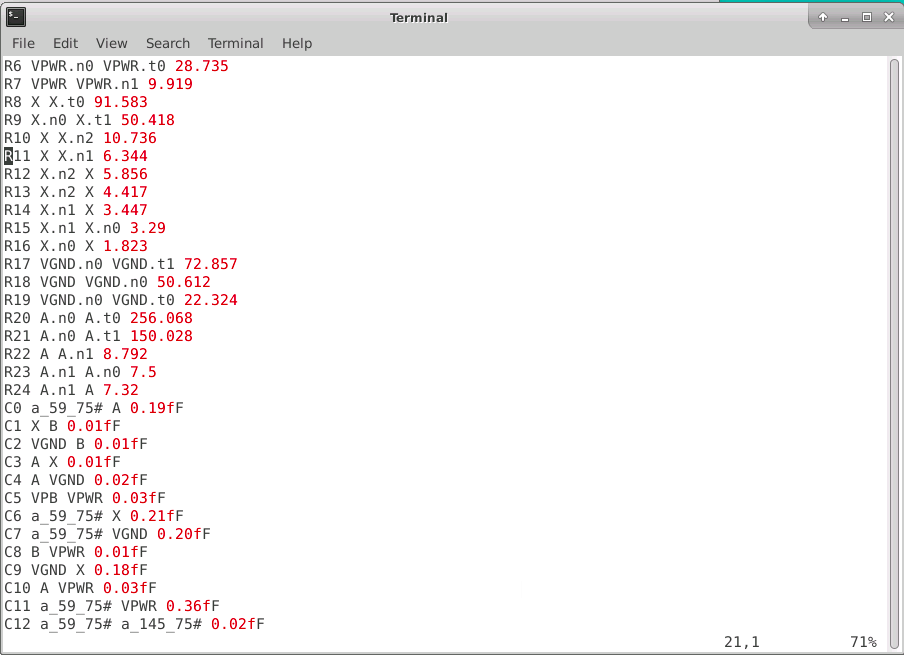
  
Task to work on:
- Obtain the netlist of the ideal circuit with the paracitics, extract the capcitances and RC netlist files and run the similations.
- Carry out a similation comparing the three different spice files (transient analsis and check how they fare as compared to each other.
  
#### Setup for DRC

```
kisku.1@pv-workshop-05:~/lab02/mag$ /usr/share/pdk/sky130A/libs.tech/magic/run_standard_drc.py /usr/share/pdk/sky130A/libs.ref/sky130_fd_sc_hd/mag/sky130_fd_sc_hd__and2_1.mag 
Evaluating full DRC results for layout sky130_fd_sc_hd__and2_1
Running: magic -dnull -noconsole -rcfile /usr/share/pdk/sky130A/libs.ref/sky130_fd_sc_hd/mag/.magicrc /home/kisku.1/lab02/mag/run_magic_drc_sky130_fd_sc_hd__and2_1.tcl
Running in directory: /usr/share/pdk/sky130A/libs.ref/sky130_fd_sc_hd/mag

Magic 8.3 revision 195 - Compiled on Thu Aug  5 04:06:36 UTC 2021.
Starting magic under Tcl interpreter
Using the terminal as the console.
Using NULL graphics device.
Processing system .magicrc file
Sourcing design .magicrc for technology sky130A ...
2 Magic internal units = 1 Lambda
Input style sky130(vendor): scaleFactor=2, multiplier=2
Scaled tech values by 2 / 1 to match internal grid scaling
Loading sky130A Device Generator Menu ...
Loading "/home/kisku.1/lab02/mag/run_magic_drc_sky130_fd_sc_hd__and2_1.tcl" from command line.
DRC style is now "drc(full)"
Loading DRC CIF style.
Using technology "sky130A", version 1.0.205-0-g6de165c
Done!
```
The follwoing commands are to check the styles for drc avialable and the one that is selected during the current run, while the batch mode has the drc style(full) selected that can be changed using the **drc style drc(full)** command on the console.
  
```
% drc listall style
drc(fast) drc(full) drc(routing)
% drc style drc(full)
DRC style is now "drc(full)"
% drc check
Loading DRC CIF style.
% 
```


This commands lists the rules that have been violated and gets printed in the console while in the GUI is displayed as **7 rules** that are being violated.
```
% drc why
All nwells must contain metal-connected N+ taps (nwell.4)
N-diff distance to P-tap must be < 15.0um (LU.2)
P-diff distance to N-tap must be < 15.0um (LU.3)
% 
```
#### Setup for LVS
#### Setup for XOR

